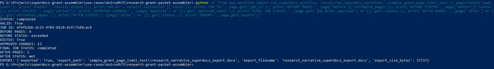

# Research Grant Packet Assembler

Built for the SuperDocs Engineer Task.

## Overview

A grant packet assembly workflow for Principal Investigators and research-office administrators preparing funder submissions.

The tool processes a research grant package containing:

- Research narrative
- Data-management plan
- Investigator CVs
- Facilities statement
- Budget justification

## What it does

- Ingests and classifies grant documents
- Extracts structured facts from each document
- Validates required grant documents
- Detects missing collaborator documents
- Converts investigator CVs into a structured biosketch format while checking content preservation
- Estimates research-narrative page limits
- Uses SuperDocs to tighten prose when the page limit is exceeded
- Supports HITL approval of proposed SuperDocs changes
- Re-checks the final page limit
- Exports the final edited document as DOCX

## SuperDocs Integration

The workflow uses the SuperDocs REST API for:

1. Document upload
2. Asynchronous editing instructions
3. Human-in-the-loop approval
4. Final document export

## Validation

The implementation was tested with:

- A valid grant package
- A deliberately missing investigator document
- A research narrative exceeding the page limit
- SuperDocs editing and HITL approval
- Final page-limit verification
- DOCX export

Example successful page-limit workflow:

6 pages -> SuperDocs editing -> HITL approval -> 5 pages -> DOCX export

## Demo Screenshot

The screenshot below shows the successful SuperDocs page-limit workflow, including editing, approval, final page-limit verification, and DOCX export.

## Built for the SuperDocs Task

This project was built on SuperDocs for the SuperDocs Engineer Task.